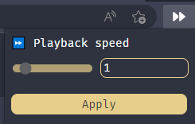

# Youtube Video Speed Changer

## **📔 Description**
Chrome extension for changing Youtube video's speed to custom values.

## **⚙ Installation**
1. Clone the repository
2. In your browser go to **Extensions** and turn on **Developer Mode**.
3. Click **Load unpacked** and choose cloned repo location.

## **👤 Credits**
Project was made by Aleksander Jóźwik ([@jozwikaleksander](https://github.com/jozwikaleksander)).